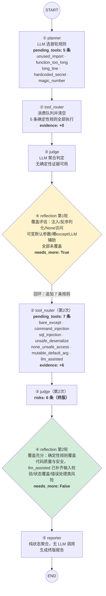

# 分析报告：commit ad5361c（本次 GitHub 推送的全部改动）

> 由 CR-Agent 自举运行：用本次推送到 GitHub 的 3 个提交（2b2f1ab → ad5361c）的合并 diff
> （10 文件、20 hunk、+98/-55 行）作为输入，跑完整的 Planner → ToolRouter → Judge →
> Reflection → Reporter 管线分析自身改动。
> 运行时间：2026-08-16，模型 deepseek-v4-pro，max_reflection_rounds=3，
> thread_id=push-ad5361c（短期记忆已完整落盘，10 个 checkpoint 可回放）。

## 1. 报告概览

| 指标 | 值 |
|---|---|
| 仓库 / Commit | CR-Agent / ad5361c |
| 扫描文件数 | 10 |
| 解析 hunk 数 | 20 |
| 累计执行规则 | 12 条（首轮 5 条 + 反思追加 7 条） |
| 累计证据数 | 6 条 |
| 最终风险数 | 6 条 |
| 总体风险分 | **0.70（high）** |
| 反思轮数 | 2（1 轮自主回环 + 1 轮判定收敛） |

被分析的改动即前几轮迭代的成果本身：移除 `hit_reflection_cap` 冗余字段、合并
`plan`/`additional_tools_needed`/`selected_tools` 为统一 `pending_tools` 队列、修复
`reflection_notes` 累加翻倍 bug、死代码清理及配套测试更新。

## 2. 执行流程可视化

实际运行轨迹（从 checkpoints.db 的 writes 表逐节点还原，数字为真实值）：

### 逐节点状态表

| 步骤 | 节点 | 关键输出 | 状态 |
|---|---|---|---|
| 1 | planner | pending_tools = [unused_import, function_too_long, long_line, hardcoded_secret, magic_number] | ✅ |
| 2 | tool_router | 5 条规则执行，+0 evidence（风格类规则在本次 diff 上零命中），队列清空 | ✅ |
| 3 | judge | 无确定性证据，risks = 0 | ✅ |
| 4 | reflection R1 | needs_more=True，追加 7 条：bare_except · command_injection · sql_injection · unsafe_deserialize · none_unsafe_access · mutable_default_arg · llm_assisted | 🔁 回环 |
| 5 | tool_router | 7 条规则执行，+6 evidence（全部来自 llm_assisted） | ✅ |
| 6 | judge | risks = 6（终版） | ✅ |
| 7 | reflection R2 | 覆盖判定收敛，needs_more=False，路由到 reporter | 🏁 收尾 |
| 8 | reporter | 聚合 evidence/risks/notes 生成报告，phase=DONE | ✅ |

## 3. pending_tools 统一队列的生命周期（本次验证目标）

本次推送的核心改动就是 `pending_tools` 队列重构，writes 表完整记录了它在真实运行中的生命周期闭环：

| 阶段 | checkpoint | 写入 | 值 |
|---|---|---|---|
| planner 首轮入队 | 1f198d93 | `pending_tools ←` | 5 条首轮规则 |
| tool_router 消费清空 | 1f198d96 | `pending_tools ← []` | 队列清空 |
| reflection 回环补队 | 1f198d99 | `pending_tools ←` | 7 条追加规则 |
| tool_router 二次消费 | 1f198d99 | `pending_tools ← []` | 队列清空 |
| reflection 收敛 | 1f198da9 | `pending_tools ← []` | 保持空，路由 reporter |

计划入队 → 消费清空 → 反思补队 → 再消费 → 收敛出队，五个环节与设计语义完全一致，
且每一步都有短期记忆落盘可审计——这正是"checkpointer 每 super-step 全量记录"价值的直接展示。

## 4. 风险清单（6 条）

| # | 等级 | 风险 | 分数 | 位置 |
|---|---|---|---|---|
| 1 | 🟠 high | 未经校验的 plan 直接赋给 pending_tools | 0.70 | src/nodes/planner.py |
| 2 | 🟡 medium | pending_tools 无条件覆盖可能丢弃已排队工具 | 0.50 | src/nodes/planner.py |
| 3 | 🟡 medium | plan 生成失败缺少错误处理 | 0.50 | src/nodes/planner.py |
| 4 | 🟢 low | 固定长度 mock side_effect 可能意外耗尽 | 0.20 | tests/test_graph.py |
| 5 | 🟢 low | 去重复断言 len(set(notes))==2 过于宽松 | 0.15 | tests/test_graph.py |
| 6 | 🟢 low | 测试假设 HunkInfo 有 model_dump 方法 | 0.15 | tests/test_graph.py |

全部 6 条风险均由 `llm_assisted` 规则产出（确定性规则在本次 diff 上零命中，符合预期：
本次改动是状态字段重构，不含注入/密钥/反序列化类模式）。要点摘录：

**Risk #1（high, 0.70）**：LLM 返回的 `plan` 未经校验直接赋给 `pending_tools`，若为
None/字符串/畸形结构，下游 ToolRouter 可能崩溃。建议：赋值前校验为字符串列表，
None 强制转为空列表。

**Risk #2（medium, 0.50）**：planner 对 `pending_tools` 是无条件整体覆盖而非合并，
理论上可能丢弃已排队条目。实际语义上 planner 只在首轮执行一次，此风险为防御性提示。

**Risk #3（medium, 0.50）**：plan 生成失败（上游 JSON 解析异常）时缺少显式守护，
可能向下游传播非法状态。

Risk #4-#6 针对测试代码的健壮性：mock 副作用列表长度硬编码、`len(set(notes))==2`
对语义重复但格式不同的场景不敏感、测试对 `model_dump` 的隐式契约依赖。

## 5. 观察

**首轮 +0 evidence 是真实语义而非空转**：5 条确定性风格/质量规则在本次重构 diff 上
没有命中任何模式（没有新增未用导入、超长函数、魔法数字等），Reflection 据此正确判定
"覆盖不足"并转向安全类规则 + llm_assisted，与上一版报告的"第三轮 ToolRouter 空转"
（无规则可加仍回环）性质不同——本次回环是有效回环，追加的 7 条规则产出了全部证据。

**llm_assisted 的定位得到验证**：Reflection 追加它是因为"逻辑错误、竞态、资源泄漏等
非确定性风险确定性规则无法可靠检出"，最终 6 条风险全部来自它，说明动态注册 +
Reflection 触发的机制按设计工作。

**反思边界收敛良好**：第 2 轮 Reflection 判定"覆盖充分"（needs_more=False）主动收敛，
未触碰 max_rounds 边界，也无需覆盖率告警——防空转校验（建议工具必须是注册且未执行过的
规则）保证了回环建议的有效性。

**风险归因准确**：本次 6 条风险的 file_path 均正确指向 planner.py / test_graph.py，
未复现上一版报告中 Judge 凭空构造 `db/queries.py` 路径的问题。

## 6. 报告复盘与处置（人工审计）

对 6 条风险逐条人工核对源码后的处置记录：

| # | 处置 | 理由 |
|---|---|---|
| 1 | ✅ 已修复 | 真实缺陷：`.get("plan", [])` 默认值不覆盖显式 `null`，None 会令 ToolRouter TypeError；字符串则逐字符静默空跑。已加 isinstance 收敛 + 4 组参数化回归测试 |
| 2 | ⛔ 不改 | planner 是图固定起点只执行一次，执行时队列必然为空，"覆盖丢失"在图结构上不可达 |
| 3 | 🚫 误报（已 feedback） | 规则只看了赋值行，未看到外层 try/except、chat_json 双重重试与 `if response else []` 兜底；残留缺口即 #1 已修 |
| 4 | ⛔ 保留现状 | 固定长度 side_effect 是刻意的调用次数契约：次数回归时测试立刻失败报警 |
| 5 | ⛔ 不改 | LLM 为 mock 输出确定，语义漂移风险极低 |
| 6 | ⛔ 不改 | `model_dump()` 是 parser 的既有契约（main.py 生产代码同写法），契约变更就该让测试红 |

修复提交：planner.py 防御性收敛 + `test_planner_node_hardens_malformed_plan` 回归测试，139 测试全绿。
Risk #3 的 false_positive 反馈已通过 `main.py feedback` 写入长期记忆（feedback 表 id=1, thread=push-ad5361c），
后续同模式运行的 Reflection 将携带该反馈上下文抑制同类误报。
